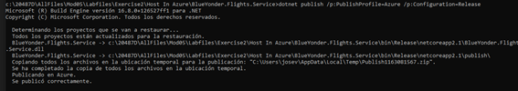
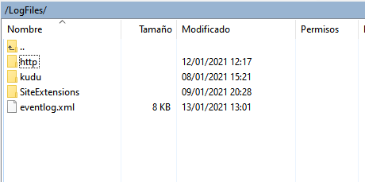
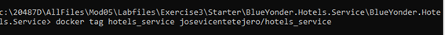
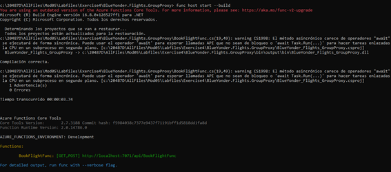
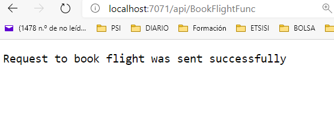

# 20487D_MOD05_LAK_EX1_BlueYonder.Flights.Service

JOSE VICENTE TEJERO - 06/01/2021

RESUMEN
**Module 5: Hosting Services On-Premises and in Azure**

**Lab: Host an ASP.NET Core service in a Windows Service**

 

**### Exercise 1: Creating an ASP.NET Core Application**

 

**#### Task 1: Create an ASP.NET Core application Project**

 

****

#### Task 2: Install the Microsoft.AspNetCore.Hosting.WindowsServices NuGet package

 

Task 3: Modify the Main method to use Kestrel RunAsService hosting

 

 

\### Exercise 2: Registering the Windows Service

\#### Task 1: Register the Windows Service

 

 

#### Task 2: Start the Windows Service and test it

 

 

 

 

# Lab: Host an ASP.NET Core Web API in an Azure Web App

### Exercise 1: Creating a Web App in the Azure Portal

#### Task 1: Run a setup script to upload a database to Azure

 

 

OutputsString      :

 

Server=tcp:blueyonder05-jvtc.database.windows.net,1433;Initial Catalog=BlueYonder.Flights.Lab05;Persist Security Info=False;User ID=BlueYonderAdmin;Password=Pa$$w0rd;MultipleActiveResultSets=False;Encrypt=True;TrustServerCertificate=False;Connection Timeout=180;

 

 

 

 

#### Task 2: Create a free website

 

#### Task 3: Configure an environment variable and the database connection string

 

#### Task 4: Configure IIS logs 

 

 

ftp://waws-prod-par-007.ftp.azurewebsites.windows.net/site/wwwroot

 

 

 

 

 

 

 

### Exercise 2: Deploying an ASP.NET Core Web API to the Web App

#### Task 1: Deploy an ASP.NET Core project to the web app

 

blueyonder-flights-jvtc 

**MyFlightAppService** 

 

 

 

#### Task 2: Test and verify the web app uses the database and environment variable

 

 

 

 

 

 

#### Task 3: Use the FTP Deployment server to view the web app and its log files

 

 

 

 

 

 

 

\# Lab: Host an ASP.NET Core service in Azure Container Instances 

\### Exercise 1: Publishing the service to a Docker container

Resultado:

#### Task 3: Push the container to a public container registry

 

Task 3: Push the container to a public container registry

 

 

 

 

 

 

 

 

 

 

### Exercise 2: Hosting the service in Azure Container Instances

#### Task 1: Create a Resource Group for Azure Container Instances

 

 

 

#### Task 2: Create an Azure Container Instance from the container image

 

 

 

"ipAddress": {

   "dnsNameLabel": "blueyonder-hotels-service-jvtc",

   "fqdn": "blueyonder-hotels-service-jvtc.eastus.azurecontainer.io",

 

   "ip": "20.75.216.169",

   "ports": [

​    {

​     "port": 80,

​     "protocol": "TCP"

​    }

   ],

   "type": "Public"

"ip": "20.75.216.169"

 

 

 

 

 

 

En Azure:

 

 

 

# Lab: Implement an Azure Function 

### Exercise 1: Developing the Service Locally

 

Task 1: Create a new Function App project in Visual Studio

 

 

 

#### Task 2: Implement an HTTP trigger that invokes the flights booking Web App

 

 

#### Task 3: Test the Function App locally in a browser

 

 

 

 

 

 

### Exercise 2: Deploying the Service to Azure Functions

#### Task 1: Deploy the service to Azure Functions from Visual Studio

 

 

 

 

Publicando:

 

#### Task 2: Test the Function App on Azure in a browser 

 

 

 

 

 

 

 
 

PROBLEMAS
No

